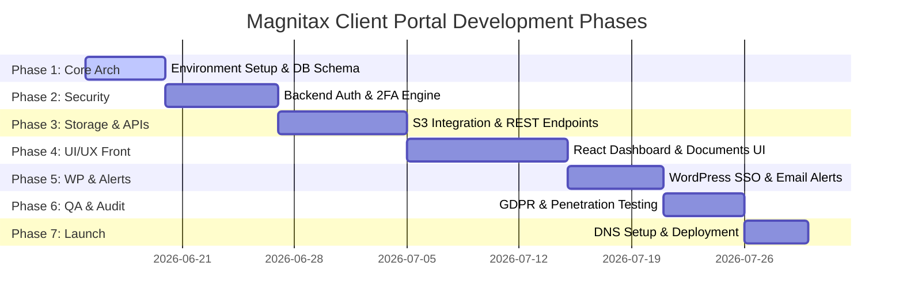

# Product Brief: Magnitax Secure Client Portal
**Document Version:** 1.0.0  
**Target Audience:** Engineering, Product, Security, and Design Teams  
**System Relationship:** Portal Subdomain (`portal.magnitax.com`) connecting to WordPress Marketing Site (`magnitax.com`)

---

## 1. [R] Requirements

### 1.1 Project Overview & Purpose
Magnitax is a professional tax services company. Its public-facing website is powered by WordPress. To scale client interactions and ensure data security, Magnitax requires a **dedicated, secure Client Portal** built on the MERN stack. 
The portal's primary purpose is to provide clients with a secure repository to view, preview, and download critical tax documents (W-2s, 1099s, and form summaries) while keeping all marketing activities on the core WordPress website.

```
┌─────────────────────────────────┐      Subdomain Link      ┌────────────────────────────────┐
│      WordPress Website          │ ───────────────────────> │    MERN Client Portal          │
│     (magnitax.com - PHP)        │ <─────────────────────── │  (portal.magnitax.com - JS)    │
│  Public Marketing, Info & Blog  │    WordPress JWT Auth    │   Secure Document Download    │
└─────────────────────────────────┘                          └────────────────────────────────┘
```

### 1.2 User Roles & Permissions
The system will support three distinct roles:
1. **Client (End User)**:
   - Access limited strictly to their own profile, notification settings, and files.
   - Can view list of documents, preview PDF documents, and download their own W-2s, 1099s, and Form Summaries.
   - Set notification preferences (email, in-app).
2. **Administrator (Tax Professional)**:
   - Full access to manage clients, upload documents, assign documents to specific clients, and view audit logs.
   - Revoke/grant user access and reset 2FA configurations.
3. **System Service Account (API)**:
   - Limited write-only access to push documents from internal CRM or storage systems to specific client folders.

### 1.3 Key Functional Requirements
- **Secure Authentication**: Traditional credentials (email/password) paired with mandatory or optional Two-Factor Authentication (2FA) via Time-based One-Time Passwords (TOTP) or secure email codes.
- **Document Repository**: Structured categorization of files by Tax Year (e.g., 2025, 2024) and Document Type (W-2, 1099, Form Summary).
- **Secure Download & Preview**: Clients must be able to securely preview documents inline (PDFs) and download them. Files must never be publicly exposed via static URLs.
- **Event-Driven Notifications**: Automatically trigger email alerts and in-app notifications whenever a new tax document is uploaded for a client.
- **Audit Trails**: Non-repudiation logging of all user activities (logins, 2FA attempts, document downloads, view actions).

---

## 2. [I] Integration

### 2.1 Backend Integrations & Document Storage
The client portal will act as a secure gateway to external storage systems where tax professionals deposit files. We support two primary integration configurations:
1. **AWS S3 (Cloud Storage Integration)**:
   - Documents are stored in an encrypted AWS S3 bucket.
   - The portal Express backend uses the AWS SDK to retrieve files and generate time-limited (e.g., 5 minutes) pre-signed URLs.
2. **CRM / Document Management System (e.g., Canopy CRM, SharePoint, or Salesforce)**:
   - Sync service listening to CRM webhooks or pulling from CRM APIs.
   - When a tax return is finalized in the CRM, a background job pushes the file metadata to MongoDB and transfers the file to the portal's secure S3 storage, or maps the CRM's native document ID to the client portal document index.

```
┌──────────────┐             1. Document Upload             ┌──────────────┐
│  Tax CRM     │ ─────────────────────────────────────────> │   Portal API │
│  (Internal)  │                                            │   Backend    │
└──────────────┘                                            └──────────────┘
       │                                                           │
       │ 2. Sync Document                                          │ 3. Fetch Presigned URL
       ▼                                                           ▼
┌──────────────┐                                            ┌──────────────┐
│  Secure S3   │ <───────────────────────────────────────── │  MongoDB     │
│  (Encrypted) │          Temporary HTTPS Link              │  (Metadata)  │
└──────────────┘                                            └──────────────┘
```

### 2.2 API Endpoint Specifications

#### Authentication API
* `POST /api/v1/auth/register`: Create a client portal account (must match a registered client email pre-authorized by admin).
* `POST /api/v1/auth/login`: Authenticate email and password; returns a temporary token indicating 2FA is required.
* `POST /api/v1/auth/verify-2fa`: Validates TOTP or email code; returns a secure HTTPS-only Cookie containing the session JWT.
* `POST /api/v1/auth/logout`: Invalidates the session and clears JWT cookies.

#### Documents API
* `GET /api/v1/documents`: Returns a list of documents available for the logged-in client. Supports query parameters `?year=2025` and `?type=w2`.
* `GET /api/v1/documents/:id`: Fetches metadata for a specific document. Returns 403 Forbidden if the document owner ID does not match the token's user ID.
* `GET /api/v1/documents/:id/preview`: Returns an inline binary stream or a highly restrictive short-lived pre-signed URL for viewing inside an embedded PDF viewer.
* `GET /api/v1/documents/:id/download`: Direct download trigger. Logs a `DOCUMENT_DOWNLOADED` event in the audit log and redirects to a one-time pre-signed download link.

#### WordPress Connection & Data Exchange (SSO & Sync)
* **Single Sign-On (SSO)**:
  - If users are logged into the WordPress site and click "Client Portal", we can establish a JWT exchange.
  - A custom WordPress PHP plugin generates a cryptographically signed payload containing the user's email and a timestamp. 
  - The MERN portal receives this payload at `GET /api/v1/auth/wp-login?token=<JWT>`, validates the signature using a shared secret key, checking if the account exists, and then triggers the 2FA flow.
* **WordPress Sync Hook**:
  - A PHP webhook in WordPress triggers a request to the MERN API `POST /api/v1/integration/wp-user-sync` whenever a client profile is updated or created in WordPress.

### 2.3 Data Models (MongoDB Schemas)

#### User Schema (`users` collection)
```json
{
  "_id": "ObjectId",
  "email": "String (Unique, Indexed)",
  "passwordHash": "String",
  "firstName": "String",
  "lastName": "String",
  "role": "String (enum: ['client', 'admin'])",
  "twoFactorSecret": "String (Encrypted at rest)",
  "isTwoFactorEnabled": "Boolean",
  "wpUserId": "Number (Optional link to WordPress ID)",
  "notificationPreferences": {
    "email": "Boolean (Default: true)",
    "inApp": "Boolean (Default: true)"
  },
  "status": "String (enum: ['pending_activation', 'active', 'suspended'])",
  "createdAt": "Date",
  "updatedAt": "Date"
}
```

#### Document Schema (`documents` collection)
```json
{
  "_id": "ObjectId",
  "ownerId": "ObjectId (Ref: Users, Indexed)",
  "fileName": "String",
  "fileType": "String (enum: ['w2', '1099', 'summary'])",
  "taxYear": "Number (Indexed)",
  "storageKey": "String (S3 Object Key)",
  "fileSize": "Number (Bytes)",
  "status": "String (enum: ['ready', 'archived'])",
  "uploadedBy": "ObjectId (Ref: Users)",
  "createdAt": "Date",
  "updatedAt": "Date"
}
```

#### Audit Log Schema (`audit_logs` collection)
```json
{
  "_id": "ObjectId",
  "userId": "ObjectId (Ref: Users, Indexed)",
  "action": "String (enum: ['LOGIN_SUCCESS', 'LOGIN_FAILED', '2FA_VERIFIED', 'DOCUMENT_PREVIEWED', 'DOCUMENT_DOWNLOADED', 'PASSWORD_RESET'])",
  "ipAddress": "String",
  "userAgent": "String",
  "details": "Object (e.g., { documentId: '...' })",
  "timestamp": "Date"
}
```

---

## 3. [S] Security

### 3.1 Authentication & Multi-Factor Security
- **Hashing**: All passwords must be hashed using `bcrypt` with a work factor of 12 before database insertion.
- **Two-Factor Authentication (2FA)**:
  - Users configure TOTP using apps like Google Authenticator or Microsoft Authenticator.
  - Setup displays a secure QR code encoding a TOTP secret key key-wrapped using AES-256 before storage in MongoDB.
  - Fallback option: 6-digit cryptographic verification code sent to the verified email address with a 5-minute expiration window.

### 3.2 Data Encryption
- **In-Transit**: Mandatory TLS 1.3 encryption for all network pathways. HTTP requests must automatically redirect to HTTPS using HTTP Strict Transport Security (HSTS) with standard headers.
- **At-Rest**:
  - AWS S3 buckets configured with Server-Side Encryption (SSE-KMS) utilizing customer-managed keys (CMK).
  - MongoDB database backups encrypted at rest. Highly sensitive database fields (e.g., `twoFactorSecret`) encrypted application-side using AES-256-GCM before database write.

### 3.3 Privacy & GDPR Compliance
- **Data Minimization**: The database must only store data necessary for identification and tax document mapping (email, name, document records). No detailed credit information or actual SSNs should reside in the portal database (they remain in the secure document PDFs stored in S3 or CRM).
- **Access Control & Logoff**: Automated session expiration after 15 minutes of inactivity. JWT cookies configured with `HttpOnly`, `Secure`, and `SameSite=Strict` flags to mitigate CSRF and session sniffing.
- **GDPR Rights Implementation**:
  - *Right to Erasure*: Admins can trigger a hard delete of a user account and their associated files from MongoDB and S3.
  - *Right to Portability*: Export utility packaging a user's metadata profile and downloading all their tax documents as a single ZIP file.
- **Consent Logs**: A mandatory checkbox on registration explicitly consenting to terms of service and file handling policies.

### 3.4 Web Vulnerability Mitigation
- **Cross-Site Scripting (XSS)**: Rigid schema validations on the server-side, escaping output in React, and deploying a strict Content Security Policy (CSP) blocking unauthorized script injections.
- **Cross-Site Request Forgery (CSRF)**: Avoid storing JWT in localStorage. Using secure, signed HTTP-only cookies guarantees browsers don't expose session tokens to malicious scripts. Double-Submit Cookie patterns or CSRF anti-forgery tokens passed via custom headers (`X-CSRF-Token`) for modifying operations.
- **Rate Limiting**: Express backend uses `express-rate-limit` to allow a maximum of 5 login attempts per 15 minutes per IP address, and 60 requests per minute for general API access.

---

## 4. [E] Experience

### 4.1 UI/UX Styling & Brand Theme
The client portal design prioritizes trust, security, and a premium aesthetic. It matches the high-quality interface styling of tools like Canopy and Honeybook.

- **Theme Palette**:
  - *Primary Background*: Deep Charcoal `#12141C` (Dark Theme-first approach).
  - *Secondary Background*: Glassmorphic slate `#1B1E29` with light borders `rgba(255,255,255,0.06)`.
  - *Accent Brand Color*: Magnitax Emerald `#10B981` (representing financial prosperity and growth) and Electric Jade `#34D399` for hover states.
  - *Alerts & Highlights*: Coral Red `#F87171` for warnings; Indigo Blue `#60A5FA` for informational tips.
  - *Text Colors*: Bright Titanium `#F3F4F6` (headings), Muted Silver `#9CA3AF` (paragraphs/subtexts).
- **Typography**: Inter (primary sans-serif) and Outfit (headings) loaded via Google Fonts, conveying precision and modernity.
- **Glassmorphism**: Heavy use of CSS backdrop-filters, subtle inner borders, and soft glowing drop-shadows to establish layout depth.

### 4.2 Page & Component Mapping

```
┌────────────────────────────────────────────────────────────────────────┐
│  Magnitax Portal  [🔔 2]                                   John Doe 👤 │
├────────────────────────────────────────────────────────────────────────┤
│ 📂 Dashboard      Welcome back, John!                                  │
│                   Your 2025 Tax Return is ready for review.            │
│ 📄 Documents                                                           │
│                   ┌──────────────────┐  ┌──────────────────┐           │
│ ⚙️ Settings        │   W-2 Forms      │  │   1099-NEC       │           │
│                   │   Year: 2025     │  │   Year: 2025     │           │
│ 🚪 Logout         │   [Download]     │  │   [Download]     │           │
│                   └──────────────────┘  └──────────────────┘           │
└────────────────────────────────────────────────────────────────────────┘
```

#### Screen Layout Specifications
1. **Secure Access Gate (Login/Register/2FA)**:
   - Centered card layout with elegant background particle waves.
   - Dynamic slide transitions between "Sign In", "Register", and "Enter 2FA Code" screens.
   - 2FA Screen features structured 6-digit individual box inputs that auto-tab to the next slot.
2. **Main Layout Frame**:
   - Left-hand Sidebar: Sticky menu containing Dashboard, Documents Center, Notification Settings, Help Support, and Logout button. Collapses into a clean bottom/top bar or hamburger slide-out on mobile devices.
   - Top Navigation Header: Breadcrumbs indicator, dynamic in-app notification bell button with red badge count, and user profile avatar.
   - Main Content Panel: Scrolling canvas displaying page components inside glassmorphic cards.
3. **Portal Dashboard**:
   - Quick-Summary Banner: Welcoming the client, indicating tax deadlines or direct call-to-actions.
   - File Overview Cards: Small dashboard tiles showing the count of files available, latest upload date, and a quick-download button.
   - Message Widget: Contact information for their assigned Magnitax tax professional.
4. **Documents Center**:
   - Search bar matching filename.
   - Filtering buttons: Segment files by Tax Year (e.g., All, 2025, 2024, 2023) and Document Category (W-2, 1099, Form Summary).
   - Document Table/Grid: Displays document name, tax year, category badge (green for W-2, blue for 1099, orange for summaries), file size, upload date, and action icons (View Eye, Download Arrow).
5. **PDF Inline Previewer**:
   - Backdrop modal that dims the dashboard.
   - Displays document metadata alongside an embedded, secure PDF renderer.
   - Restricts right-click and contains a download action button that queries the secure API.
6. **Notification & Settings Panel**:
   - Toggle switch controls to enable/disable Email alerts for "New Document Uploads" and "Account Security Changes".
   - 2FA configuration wizard: Allow users to disable/re-enable authenticator apps (requires validating active password).

---

## 5. [N] Next Steps

### 5.1 Tech Stack & Tools Detail
- **Frontend**: React 18+ (Vite builder for fast loading and bundles), React Router (routing), Axios (API queries), TailwindCSS or Vanilla CSS modules.
- **Backend**: Node.js v18+ running Express.js for fast API processing.
- **Database**: MongoDB (Atlas cloud cluster) using Mongoose ODM.
- **Security Tools**: `jsonwebtoken` (JWT creation), `otplib` (TOTP generation/validation), `bcryptjs` (password hashing), `helmet` (security headers), `express-rate-limit` (anti-brute-force).
- **Notification Services**: SendGrid API or AWS SES integrated using `nodemailer` for email deliveries.

### 5.2 Deployment Architecture
- **Environment Targeting**:
  - *Frontend Hosting*: Vercel or Netlify. Global CDN integration ensures rapid loading of the React interface.
  - *Backend Hosting*: AWS Elastic Beanstalk or a secure Linux VPS (DigitalOcean Droplet / Linode) managed via PM2.
  - *Database Service*: MongoDB Atlas. Configured with IP access list restrictions only allowing connections from the Express server.
  - *File Storage*: AWS S3 Bucket. Bucket access policy set to completely private (no public access); files only accessible via Backend IAM-issued presigned URLs.
- **DNS Subdomain Routing**:
  - WordPress DNS managed in Cloudflare (`magnitax.com` pointing to WP web server).
  - Add CNAME record `portal.magnitax.com` pointing to the React frontend hosting endpoint.
  - CORS configurations on Express API strictly set to allow headers only from `https://portal.magnitax.com`.

### 5.3 Development Phases & Timeline



1. **Phase 1: Core Architecture & Setup (5 days)**: Setup MongoDB schemas, initialize Express backend boilerplates, and verify environment variable handling.
2. **Phase 2: Authentication & Security Controls (7 days)**: Implement password hashing, JWT session cookies, rate limiters, and the TOTP/Email 2FA workflow logic.
3. **Phase 3: Integration & Core API endpoints (8 days)**: Configure AWS S3 connection keys, implement API upload and download streams, and test S3 signed-url generators.
4. **Phase 4: Frontend Development (10 days)**: Build the glassmorphic styling system, the main dashboard UI, the interactive search/filter document gallery, and the PDF modal viewer.
5. **Phase 5: WordPress Webhooks & Notifications (6 days)**: Script the PHP SSO payload generator in WordPress, sync data webhooks, and integrate Nodemailer for transactional email triggers.
6. **Phase 6: QA, Compliance & Audit (5 days)**: Execute GDPR validation scripts, audit security cookies, run automated load tests, and double-check roles authorization limits.
7. **Phase 7: Deployment & DNS Launch (4 days)**: Deploy frontend/backend packages, link Cloudflare DNS configurations, configure production SSL, and execute run-through tests.

### 5.4 Verification & Acceptance Criteria
The project is successful and ready for client onboarding when the following criteria are met:
1. **Secure Multi-Factor Authentication**: Verification that no user can access the main dashboard without submitting both correct credentials and a valid 2FA token.
2. **Strict Access Containment**: Penetration testing verifies that modifying URL IDs in a client browser session generates a `403 Forbidden` error when trying to fetch documents of other clients.
3. **Download Traceability**: Every file download creates a logged record in the `audit_logs` collection detailing who downloaded it, when, and from what IP.
4. **Instant Event Trigger**: When a document metadata schema is saved, an email notification successfully lands in the target client's mailbox within 30 seconds.
5. **Fluid Responsive Experience**: Complete interface functionality behaves cleanly on mobile resolutions (375px wide), tablet resolutions (768px), and high-resolution screens (1920px+).
6. **Robust WP Handshake**: Clients logged into the main WordPress instance can securely hop over to the MERN portal via the SSO link without needing to re-enter email/password credentials, proceeding directly to the 2FA verify step.
